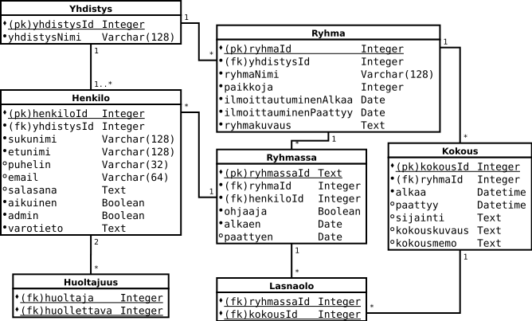

# Tietokantasovelluksen harjoitustyö Paikalla

Paikalla-palvelun avulla yhdistyksen jäsenet (tai heidän huoltajansa) voivat ilmoittautua ryhmiin sekä katsoa ryhmien kokousajat ja ohjaajien yhteystiedot.

Ohjaajat pitävät kirjaa läsnäolleista, ja ohjelma tuottaa tarpeelliset toimintatilastot.

Järjestelmä muodostaa jokaiselle siihen liittyneelle yhdistykselle erillisen palvelun, mutta julkaisee kaikkien yhdistysten yhteenvetotilastoa (jonka avulla yhdistykset voivat kilpailla aktiivisimman yhdistyksen tittelistä)

## Tietokantakaavio

