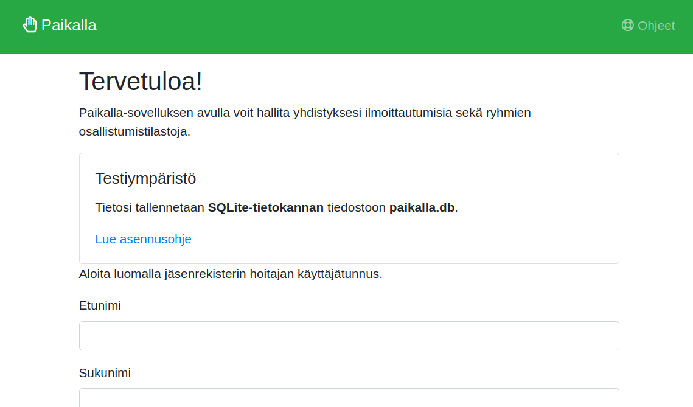

# Paikalla-sovelluksen asentaminen

## Paikallinen asennus

1. Kloonaa sovellus GitHubista haluamaasi hakemistoon
```
~$ git clone git@github.com:artoh/paikalla.git
```

2. Luo sovellukselle Pythonin virtuaaliympäristö ja ota se käyttöön
```
~$ cd paikalla
~/paikalla$ python3 -m venv venv
~/paikalla$ source venv/bin/activate
```

3. Asenna sovelluksen vaatimat riippuvuudet
```
(venv) ~/paikalla$ pip install -r requirements.txt
```

4. Ohjelma on valmis käynnistettäväksi!
```
(venv) ~/paikalla$ python run.py
```

5. Ensimmäisellä käynnistyskerralla sovellus opastaa sinua luomaan jäsenrekisterin hoitajan käyttäjätunnuksen



Tässä on kuvattu ohje sovelluksen asentamisesta kehitysympäristöön SQLite-tietokannalla. Ohjeita tuontantokäyttöön asentamisesta omalle Apache- tai nginx-palvelimella löytyy [Flaskin dokumentaatiosta](http://flask.palletsprojects.com/en/1.1.x/deploying/)

## Asentaminen Herokuun

Jatka edellä olevista paikalliseen käyttöön asentamisen ohjeista:

5. Luo sovellus Herokuun ja lisää versionhallintaan Heroku-yhteys
```
~/paikalla$ heroku create sovelluksen_nimi_Herokussa
~/paikalla$ git remote add heroku https://git.heroku.com/sovelluksen_nimi_Herokussa
```

6. Lisää Herokun tarvitsemat määritteet aikavyöhykkeestä, paikallistamisesta sekä PostgreSQL-tietokannasta
```
~/paikalla$ heroku config:set PRODUCTION=1
~/paikalla$ heroku config:set TZ="Europe/Helsinki"
~/paikalla$ heroku pq:psql
~/paikalla$ heroku addons:add heroku-postgresql:hobby-dev
~/paikalla$ heroku buildpacks:add https://github.com/heroku/heroku-buildpack-locale
```

7. Lähetä sovellus Herokuun
```
~/paikalla$ git push heroku master
```

8. Ensimmäisellä käynnistyskerralla sovellus opastaa sinua luomaan jäsenrekisterin hoitajan käyttäjätunnuksen.

  Varmista, että tervetuloruutu ilmoittaa **tuotantoympäristön** olevan käytössä. Muussa tapauksessa kohdassa 6 neuvotut asetukset eivät ole onnistuneet, ja tietokanta tyhjentyy joka kerta sovelluksen käynnistyessä uudelleen.
