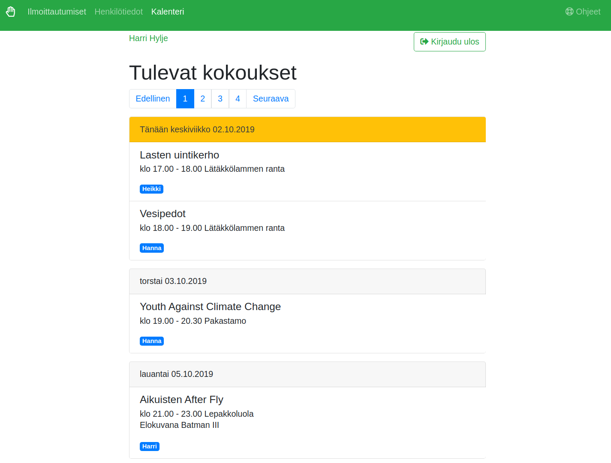
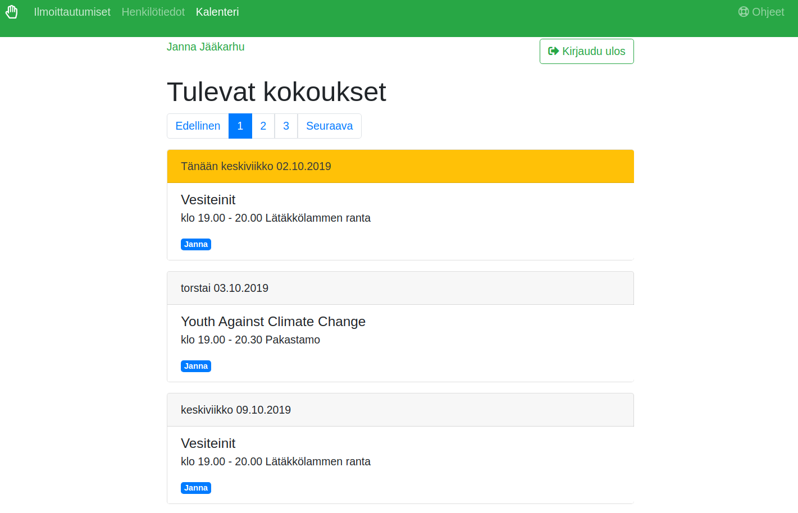

# Käyttöohje

<!-- TOC depthFrom:2 depthTo:6 withLinks:1 updateOnSave:1 orderedList:0 -->

- [Ohje jäsenelle ja huoltajalle](#ohje-jäsenelle-ja-huoltajalle)
	- [Tunnuksen luominen](#tunnuksen-luominen)
	- [Huollettavat](#huollettavat)
	- [Omat henkilötiedot](#omat-henkilötiedot)
	- [Omat ja huollettavien ilmoittautumiset](#omat-ja-huollettavien-ilmoittautumiset)
	- [Uusi ilmoittautuminen](#uusi-ilmoittautuminen)
	- [Kalenteri](#kalenteri)
- [Ohje alle 18-vuotiaalle jäsenelle](#ohje-alle-18-vuotiaalle-jäsenelle)
- [Ohje ryhmän ohjaajalle](#ohje-ryhmän-ohjaajalle)
	- [Ryhmän tiedot](#ryhmän-tiedot)
	- [Ryhmän jäsenet](#ryhmän-jäsenet)
	- [Ryhmän kokoukset](#ryhmän-kokoukset)
	- [Läsnäolleiden merkitseminen](#läsnäolleiden-merkitseminen)
	- [Ryhmän tilasto](#ryhmän-tilasto)
- [Ohje jäsenrekisterin hoitajalle](#ohje-jäsenrekisterin-hoitajalle)
	- [Jäsenten hallinta](#jäsenten-hallinta)
	- [Ryhmien hallinta](#ryhmien-hallinta)
	- [Tilastot](#tilastot)

<!-- /TOC -->

## Ohje jäsenelle ja huoltajalle

Yhdistyksemme käyttää Paikalla-sovellusta ryhmiin ilmoittautumiseen sekä jäsentietojen ylläpitämiseen. Sovelluksesta näet omat henkilötietosi, ilmoittautumisesi sekä tulevat kokoukset.

Alle 18-vuotiaan ilmoittautumiset tekee aina alaikäisen huoltaja **omalla käyttäjätunnuksellaan**. Huoltaja voi luoda itselleen käyttäjätunnuksen myös ilman, että huoltaja liittyy yhdistyksen jäseneksi.

### Tunnuksen luominen

Paina aloitusnäytöllä *Rekisteröidy*-painiketta.

Täytä rekisteröitymislomake.
Kirjautuessasi sovellukseen käytät tässä ilmoittamaasi *sähköpostiosoitetta* sekä *salasanaa*.
Salasana on oltava vähintään kuusi merkkiä pitkä.

### Huollettavat

Tehdäksesi ilmoittatumisia lapsesi puolesta, lisää lapsen tiedot valitsemalla *Henkilöt*-välilehdeltä *Lisää huollettava*.

Merkitse *Huomioon otettavaa* kohtaan sellaiset asiat, joita lapsesi ryhmien ohjaajien on hyvä tietää lapsestasi.

Kun olet tallentanut tiedot, tulevat lapsesi henkilötiedot näkyville omien henkilötietojesi alapuolelle:

Lisätäksesi lapsellesi toisen huoltajan, pitää toisen huoltajan luoda ensin itselleen käyttäjätunnus järjestelmään. Paina sen jälkeen *Henkilötiedot*-välilehdelle lapsen nimen vieressä olevaa *Lisää huoltaja*-painiketta.

Anna se sähköpostiosoite, millä toinen huoltaja on rekisteröityt palveluun, ja paina *Lisää huoltaja*.

Jos olet merkinnyt lapsesi tietoihin sähköpostiosoitteen, voit luoda lapsellesi salananan, jolla hän pääsee katsomaan omia ilmoittautumisiaan ja kalenteriaan. Paina lapsen nimen vieressä olevaa *Vaihda salasana* -painiketta. Samalla painikkeella voit myös vaihtaa lapsesi puolesta salasanan, jos hän on unohtanut sen.

### Omat henkilötiedot

*Henkilötiedot*-välilehdellä näet omat henkilötietosi. Voit ilmoittaa muuttuneet henkilötietosi *Muokkaa tietoja* -painikkeella sekä vaihtaa oman salasanasi.

### Omat ja huollettavien ilmoittautumiset

*Ilmoittautumiset*-välilehdellä näet omat ja lastesi ilmoittautumiset. Ryhmän yhteydessä olevasta *Ohjaajat ja kokoukset*-napista näet ryhmäsi ohjaajien yhteystiedot sekä tiedossa olevat ryhmän tulevat kokoontumiset.

### Uusi ilmoittautuminen

Ilmoittaudu uuteen ryhmään *Ilmoittautumiset*-välilehdellä olevalla *Uusi ilmoittautuminen*-painikkeella. Ilmoittaaksesi lapsen paina lapsen nimen vieressä olevaa ilmoittautumispainiketta.

Näet luettelon ryhmistä, joihin voit ilmoittautua. Paina haluamasi ryhmän kohdalla *Lisätiedot ja ilmoittautuminen*-painiketta, niin näet yksityiskohtaisemmat tiedot ryhmästä, ohjaajista ja kokoontumisista.

Vahvista ilmoittautumisesi *Ilmoittaudu* -painikkeella.

Jos haluat perua ilmoittautumisen, ota yhteyttä jäsenrekisterin hoitajaan tai ryhmäsi ohjaajaan.

### Kalenteri

*Kalenteri*-välilehdellä näet sekä omat että huollettaviesi tulevat kokoontumiset.

## Ohje alle 18-vuotiaalle jäsenelle

Huoltajasi voi asettaa sinulle salasanan, jolla pääset kirjautumaan Paikalla-sovellukseen ja näet ilmoittautumiset.

Kirjaudu palveluun huoltajasi ilmoittaalla sähköpostiosoitteella ja salasanalla.

*Ilmoittautumiset*-välilehdelle näet omat ryhmäsi. *Ohjaajat ja kokoukset*-painikkeesta pääset näkemään ryhmäsi ohjaajien yhteystiedot ja kaikkien tiedossa olevien tulevien kokousten tiedot.

Uudet ilmoittautumiset tekee huoltajasi sinun puolestasi omalla tunnuksellaan.

*Henkilötiedot*-välilehdellä näet omat henkilötietosi. Jos tietosi ovat muuttuneet, tekee huoltajasi muutokset omalla tunnuksellaan.

*Vaihda salasanaa* -painikkeella voit vaihtaa oman salasanasi.

*Kalenteri*-välilehdellä näet tulevien kokousten ajankohdat.

## Ohje ryhmän ohjaajalle

Kun toimit ryhmän ohjaajana, on sinulla *Ilmoittautumiset*-välilehdellä ryhmäsi kohdalla *Ohjaajan näkymä*-painike.

### Ryhmän tiedot

Pääset muokkaamaan ryhmäsi tietoja. *Ryhmän kuvaus* näkyy, kun yhdistyksen jäsenet selaavat ilmoittautumistoiminnolla ryhmien tietoja.

Ellei ryhmässä ole määritelty ilmoittautumisaikaa tai paikkoja, ei ryhmään voi ilmoittautua itse. Ryhmän ohjaaja tai jäsenrekisterin hoitaja voi kuitenkin lisätä jäseniä ryhmään.

### Ryhmän jäsenet

Voit lisätä ryhmän jäsenen valitsemalla jäsenen *Valitse lisättävä jäsen* -valikosta ja painamalla *Lisää ryhmään*.

Jos nimen perässä on kolmio, on ryhmäläiselle ilmoitettu huomioon otettavia asioita, jotka näet koskettamalla kolmiota. Painamalla nimeä näet ryhmän jäsenen tarkemmat tiedot sekä huoltajan yhteystiedot, sekä voit myös merkitä jäsenen eronneeksi ryhmästä.

### Ryhmän kokoukset

Painikkeella *Lisää kokous* lisäät yksittäisen kokouksen ja painikkeella *Lisää kokoussarja* lisäät viikoittain samana viikonpäivänä ja samaan kellonaikaan toistuvia kokouksia haluamallesi aikavälille.

Jos olet lisäämässä esimerkiksi koko syksyn kokouksia, mutta ryhmänne ei kokoonnu syyslomalla, lisää ensin kokoussarja koko ajalle ja poista sen jälkeen sen yksittäisen viikon kokous, kun ryhmänne ei kokoonnu.

Kokouksen tiedoissa *Ennakkotiedot* on näytetään ryhmän jäsenille kokouslistauksen ja kalenterin yhteydessä. Siihen voi merkitä kokouksen aiheen, mukaan tarvittavat varusteet tai muuta kokoukseen liittyvää tietoa.

### Läsnäolleiden merkitseminen

Helpoiten pääset merkitsemään läsnäolevia painamalla omassa kalenterissasi kokouksen kohdalla *Ohjaajan näkymä* -painiketta. Läsnäolleiden merkitsemisnäkymä avautuu 15 minuuttia ennen kokouksen alkamista - sitä ennen painikkeesta pääsee muokkaamaan kokoontumisen ennakkotietoja.

Jälkeenpäin pääset merkitsemään läsnäolleet ryhmän *Menneet kokoukset* -välilehdeltä.

Merkitse rastittamalla kokouksessa läsnäolleet.
Voit myös tehdä muistiinpanoja kokouksista.

Jäsenen nimeä painamalla näet jäsenen tiedot sekä huoltajan yhteystiedot.

### Ryhmän tilasto

(Toimintoa ei vielä toteutettu)

## Ohje jäsenrekisterin hoitajalle

### Jäsenten hallinta

*Jäsenet*-välilehdellä pääset lisäämään uusia jäseniä, sekä muokkaamaan jäsenten kaikkia tietoja.

Jäsen merkitään eronneeksi lisäämällä eroamispäivämäärä *Jäsenyys päättyi* -kenttään. Voit myös poistaa jäsenen kokonaan jäsenrekisteristä *Poista jäsen* -napilla.

Jäsentietojen *Huoltajat* ja *Huollettavat* -välilehdellä *Linkitä*-toiminto lisää huoltajaksi henkilön, joka on jo jäsenrekisterissä (jäsenenä tai huoltajana) ja *Lisää uusi henkilö* lisää jäsenrekisteriin kokonaan uuden henkilön.

Merkitsemällä ruksin kohtaan *Jäsentietojen käsittelyyn oikeutettu yhdistyksen toimihenkilö* annat toiselle käyttäjälle kaikki pääkäyttäjän oikeudet, myös oikeuden muuttaa kenen tahansa käyttäjän salasana.

### Ryhmien hallinta

Jäsenrekisterin hoitajalla on kaikkiin ryhmiin kaikki samat oikeudet kuin ryhmän ohjaajalla. Lisäksi voit lisätä uusia ryhmiä sekä poistaa olemassaolevan ryhmän.

Kun ryhmä on perustettu, vain jäsenrekisterin hoitaja voi lisätä sille ensimmäisen ohjaajan.

Jos poistat ryhmät, poistuvat myös kaikki siihen liittyvät tilastomerkinnät. Merkitse ryhmä mieluummin päättyneeksi.

### Tilastot

(Toimintoa ei vielä toteutettu)
