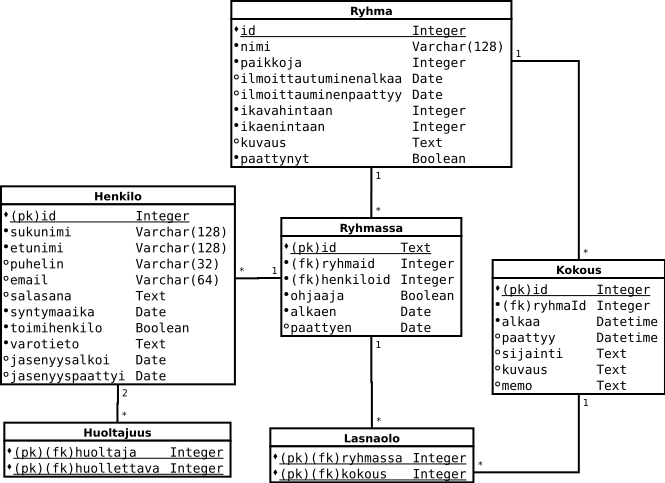

# Tietokantarakenne



## Henkilo

Järjestelmään rekisteröity käyttäjä (jäsen ja/tai huoltaja)

```sql
CREATE TABLE "Henkilo" (
 id INTEGER NOT NULL,
 etunimi VARCHAR(128) NOT NULL,
 sukunimi VARCHAR(128) NOT NULL,
 puhelin VARCHAR(32),
 email VARCHAR(64),
 salasana TEXT,
 syntymaaika DATE NOT NULL,
 toimihenkilo BOOLEAN,
 varotieto TEXT,
 jasenyysalkoi DATE,
 jasenyyspaattyi DATE,
 PRIMARY KEY (id),
 UNIQUE (email)
);

CREATE INDEX ix_henkilo_sukunimi ON henkilo (sukunimi)
```
Salasanasta tallennetaan bcrypt-tiiviste.
Toimihenkilö tarkoittaa jäsenrekisteritietojen käsittelyyn oikeutettua yhdistyksen toimihenkilöä (pääkäyttäjäoikeudet).


## Huoltajuus

Tieto alaikäisen lapsen huoltajista. Huoltaja tekee ilmoittautumiset sekä muokkaa henkilötietoja lapsensa puolesta, kunnes tämä täyttää 18 vuotta.

```sql
CREATE TABLE huoltajuus (
  huoltaja INTEGER NOT NULL,
  huollettava INTEGER NOT NULL,
  PRIMARY KEY (huoltaja, huollettava),
  FOREIGN KEY(huoltaja) REFERENCES henkilo (id) ON DELETE CASCADE,
  FOREIGN KEY(huollettava) REFERENCES henkilo (id) ON DELETE CASCADE
);
```
Ohjelma valvoo, että huollettava on alle 18-vuotias ja huoltaja yli 18-vuotias (tarkastuksia ei toteutettu tietokannassa).

## Ryhma

Tieto yhdistyksen toimintaryhmästä sekä ilmoittautumisessa tarvittavat tiedot.

```sql
CREATE TABLE ryhma (
  id INTEGER NOT NULL,
  nimi VARCHAR(128) NOT NULL,
  paikkoja INTEGER,
  ilmoittautuminenalkaa DATE,
  ilmoittautuminenpaattyy DATE,
  ikavahintaan INTEGER,
  ikaenintaan INTEGER,
  kuvaus TEXT, paattynyt BOOLEAN,
  PRIMARY KEY (id)
);

CREATE INDEX ix_ryhma_ikaenintaan ON ryhma (ikaenintaan);
CREATE INDEX ix_ryhma_ikavahintaan ON ryhma (ikavahintaan);
CREATE INDEX ix_ryhma_ilmoittautuminenalkaa ON ryhma (ilmoittautuminenalkaa);
CREATE INDEX ix_ryhma_ilmoittautuminenpaattyy ON ryhma (ilmoittautuminenpaattyy);
CREATE INDEX ix_ryhma_nimi ON ryhma (nimi);
CREATE INDEX ix_ryhma_paattynyt ON ryhma (paattynyt);
CREATE INDEX ix_ryhma_paikkoja ON ryhma (paikkoja);
```
Ryhmän vähimmäis- ja enimmäisiät ovat vuosina (verrataan henkilön ikään täysinä vuosina).


## Ryhmassa

Tieto yhden henkilön jäsenyydestä yhdessä ryhmässä.

```sql
CREATE TABLE ryhmassa (
  id INTEGER NOT NULL,
  ryhmaid INTEGER NOT NULL,
  henkiloid INTEGER NOT NULL,
  ohjaaja BOOLEAN,
  alkaen DATE NOT NULL,
  paattyen DATE,
  PRIMARY KEY (id),
  FOREIGN KEY(ryhmaid) REFERENCES ryhma (id) ON DELETE CASCADE,
  FOREIGN KEY(henkiloid) REFERENCES henkilo (id) ON DELETE CASCADE
);
```
Ryhmän ohjaajaksi merkityllä henkilöllä on oikeudet ryhmän tietojen muokkaamiseen sekä ryhmän jäsnenten tietojen katsomiseen.


## Kokous

Tieto ryhmän yhdestä kokouksesta

```sql
CREATE TABLE kokous (
  id INTEGER NOT NULL,
  ryhmaid INTEGER NOT NULL,
  alkaa DATETIME NOT NULL,
  paattyy DATETIME,
  sijainti TEXT,
  kuvaus TEXT,
  memo TEXT,
  PRIMARY KEY (id),
  FOREIGN KEY(ryhmaid) REFERENCES ryhma (id) ON DELETE CASCADE
);

CREATE INDEX ix_kokous_alkaa ON kokous (alkaa);
```

Normalisointi vaatisi periaatteessa, että kokouspaikoista (sijainnit) muodostettaisiin oma taulunsa, johon viitattaisiin Kokoukset-taulusta.
Koska ohjelman toiminnallisuuteen ei kuulu kokousten tarkastelua kokouspaikoittain taikka kokouspaikkojen varauskalenteria, on tämä ratkaisu,
jossa tieto kokouspaikasta tallennetaan merkkijonona, kuitenkin joustavampi (etenkin, mikäli ryhmä esimerkiksi tekee paljon retkiä ja siten kokoontuu useassa eri paikassa).

## Lasnaolo

Tieto yhden ryhmän jäsenen läsnäolosta yhdessä kokoontumisessa

```sql
CREATE TABLE lasnaolo (
  ryhmassa INTEGER NOT NULL,
  kokous INTEGER NOT NULL,
  PRIMARY KEY (ryhmassa, kokous),
  FOREIGN KEY(ryhmassa) REFERENCES ryhmassa (id) ON DELETE SET NULL,
  FOREIGN KEY(kokous) REFERENCES kokous (id) ON DELETE CASCADE )
```
